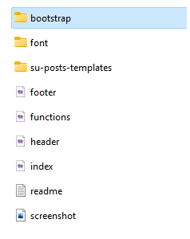
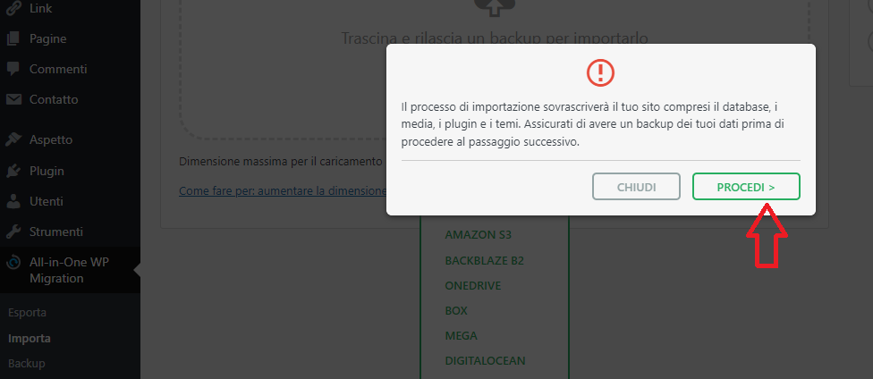
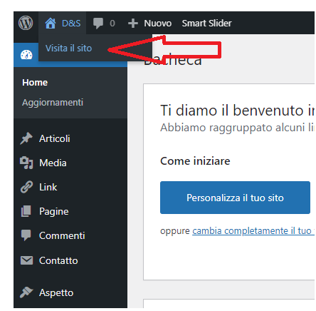

<h1 algin="center">Progetto-wordpress-1</h1>

  
Sommario

  <ol>
    <li>
      <a href="#informazioni-sul-progetto">Informazioni sul progetto</a>
      <ul>
        <li><a href="#costruito-con">Costruito con</a></li>
      </ul>
    </li>
   <li><a href="#descrizione">Descrizione</a>
     <ul>
        <li><a href="#struttura-repository">Struttura Repository</a></li>
        <li><a href="#Download-e-testare-sito-in-locale">Download e testare sito in locale</a></li>
      </ul>
    </li>
   <li><a href="#licenza">Licenza</a></li>
  <ol>

<!-- Informazioni sul progetto-->

## Informazioni sul progetto
In questo progetto si è realizzato un sito per un'attività commerciale, in particolare una pasticceria-gelateria utilizzando wordpress.

 

#### <h3>Costruito con:</h3>

<b>CMS</b>:
- [Wordpress] (https://it.wordpress.org/)

<b>Framework</b>
- [Bootstrap] (https://getbootstrap.com/)

<b>Database</b>
  
  - MySQL 
    
<b>Software per lo sviluppo in locale</b>
 - [LOCAL] (https://localwp.com/features/)
   
<!--Descrizione-->

## Descrizione

### Struttura Repository

<h4>Cartella D&S </h4>
 Contiene il tema realizzato su misura per questo progetto.
    
<h4>File progetto-wordpress.wpress</h4>
 Questo file è stato generato dal plugin "All-in-One Wp Migration".
 Può essere utilizzato per importare il sito online, oppure per 
 testare il sito in locale utilizzando un'applicazione di sviluppo Wordpress locale.

### Tema D&S
   
    
  Il tema D&S è un tema one page.
  Per realizzare questo tema è stato utilizzato:
    <ol>
      <li>framework bootstrap;</li>
      <li>plugin di wordpress:
        <ul>
          <li>Smart Slider 3: utilizzato per creare il carousel e la gallery</li>
          <li>Shortcodes Ultimate: utilizzato per generare shortcode</li>
          <li>Contact Form 7: per creare il Form di contatti.</li>
        </ul>
      </li>
    </ol>
  - Cartella "su-posts-templates": contiene il file 'my-template.php' 
    utilizzato dal plugin 'Shortcodes Ultimate' per visualizzare i 'singol-post'.

### Download e testare sito in locale

- Sul proprio dispositivo è necessario:
   - Configurare sulla macchina uno stack AMP locale. Nel caso di WordPress, AMP sta per Apache, MySQL, PHP.
     Per esempio 'Local' è l'applicazione di sviluppo Wordpress locale utilizzata per sviluppare questo sito.
   - installazione di Worpress.
  

Il sito può essere testato in locale eseguendo i seguenti passaggi:

- Clonare il repository del progetto in locale 

- Installare su wordpress il plugin 'All-in-One WP Migration'.
- Tramite il plugin 'All-in-One WP Migration'importare il file 'progetto-wordpress.wpress'
  
   
  

  

- Testare il sito in locale.

 

